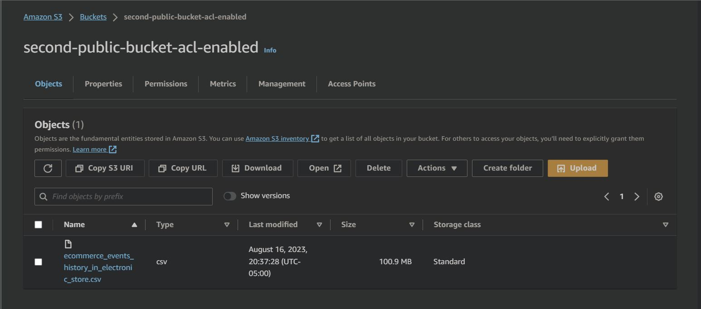
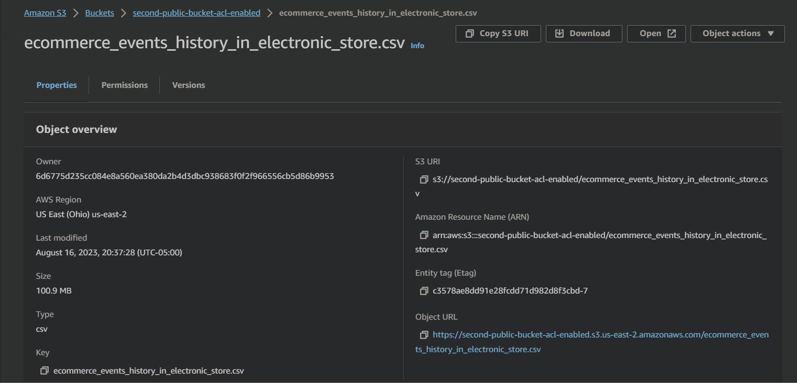

# Almacenamiento de objetos en AWS S3
la creación de un bucket en AWS S3 y la distribución pública de archivos son pasos esenciales para aprovechar las capacidades de almacenamiento en la nube de AWS y permitir un acceso seguro y eficiente a los datos. Esta integración con los servicios de AWS facilita la construcción de soluciones más robustas y escalables en la nube.
## Crea un bucket: 
Haz clic en el botón "Create bucket" (Crear bucket). Debes proporcionar un nombre único para tu bucket. Los nombres de los buckets son globalmente únicos, por lo que elige un nombre único y recuerda que no se pueden cambiar una vez creados. Además, selecciona la región de AWS donde deseas que esté ubicado el bucket.

## Sube el archivo CSV: 
Una vez que el bucket esté creado, ábrelo haciendo clic en su nombre. Luego, selecciona "Upload" (Subir) y selecciona tu archivo CSV desde tu computadora local. Puedes optar por configurar las propiedades del archivo, como el control de acceso y las etiquetas.

Finalmente, yaque tenemos el csv alojado publicamente en AWS S3, usaremos la url de este objeto para realizar el análisis exploratorio en python.
Link del objeto creado:
https://second-public-bucket-acl-enabled.s3.us-east-2.amazonaws.com/ecommerce_events_history_in_electronic_store.csv
